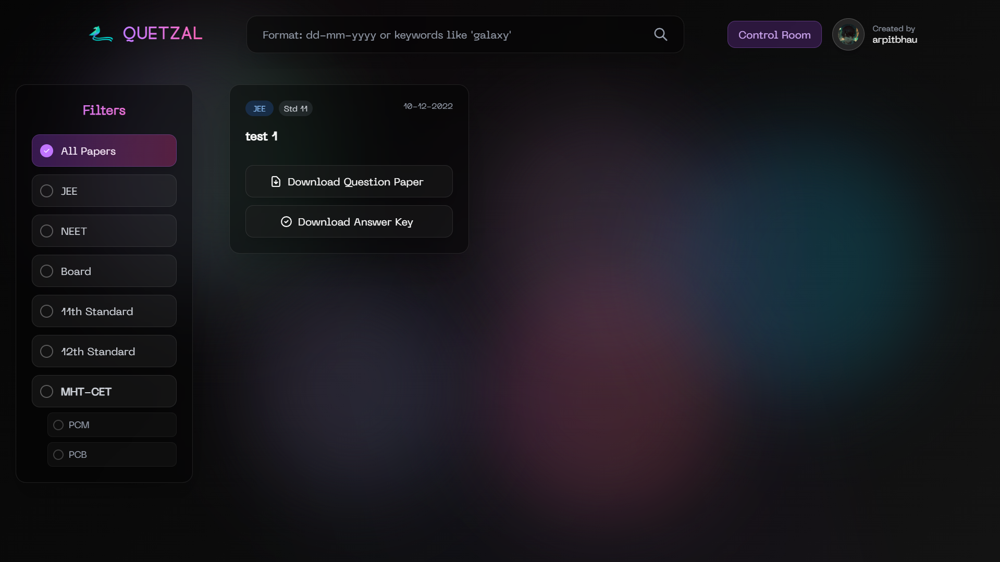
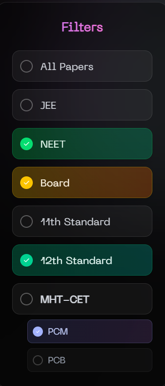
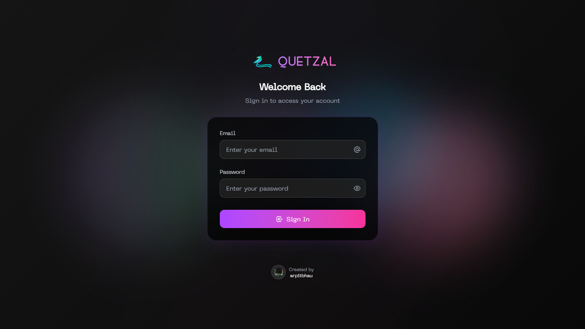

# 🦅 Quetzal - Academic Paper Management System

A web application for managing and searching academic papers, question papers, and study materials. Built with React, Node.js, and Supabase for authentication and data management.


## 📸 Screenshots

### Home Page (Student View)


### Filters for bettter search


### Login Page


### Dashboard (Admin View)


## Features

- Real-time search with debounced input
- Date-based and keyword search
- Filter by category (JEE, NEET, Board, MHT-CET) and standard (11th, 12th)
- Upload, edit, and delete papers (PDFs for question and answer key)
- Download files for each paper
- Supabase authentication for protected dashboard
- Responsive design with dark theme and animations

## Architecture

### Frontend
- React 19 (functional components, hooks)
- Vite for development/build
- Tailwind CSS for styling
- Framer Motion and GSAP for animations
- React Router for routing
- Axios for HTTP requests

### Backend
- Node.js with Express.js
- Multer for file uploads
- CORS support
- File streaming and static file serving

### Database & Auth
- Supabase for authentication and data storage

## Quick Start

### Prerequisites
- Node.js (v18 or higher)
- npm or yarn
- Supabase account and project

### Installation

1. Clone the repository
   ```bash
   git clone https://github.com/arpitbhau/quetzal.git
   cd quetzal
   ```
2. Set up environment variables in `client/.env`:
   ```env
   VITE_SUPABASE_URL=your_supabase_project_url
   VITE_SUPABASE_API_KEY=your_supabase_anon_key
   ```
3. Install dependencies:
   ```bash
   cd client && npm install
   cd ../server && npm install
   ```
4. Start the servers:
   ```bash
   # In server directory
   npm run dev
   # In client directory
   npm run dev
   ```
5. Access the app:
   - Frontend: http://localhost:5173
   - Backend: http://localhost:3000

## Project Structure

```
quetzal/
├── client/                 # React frontend
│   ├── public/            # Static assets
│   ├── src/
│   │   ├── data/         # Data management
│   │   ├── pages/        # Page components
│   │   ├── supabase/     # Supabase config
│   │   ├── App.jsx       # Main app
│   │   └── main.jsx      # Entry point
│   ├── package.json
│   └── vite.config.js
├── server/                # Node.js backend
│   ├── api/              # API routes
│   ├── controller/       # Logic
│   ├── uploads/          # File storage
│   ├── package.json
│   └── server.js         # Server entry
└── README.md
```

## Supabase Setup

1. Create a Supabase project
2. Enable authentication (Email/Password)
3. Create a table named `quetzal`:
   ```sql
   CREATE TABLE quetzal (
     id SERIAL PRIMARY KEY,
     data JSONB NOT NULL
   );
   INSERT INTO quetzal (data) VALUES ('[]');
   ```

## Usage

### Students
- Browse/search/filter papers
- Download question papers and answer keys

### Administrators
- Login to dashboard
- Upload, edit, and delete papers
- Manage PDF files for each paper

## Development

### Client Scripts
```bash
npm run dev      # Dev server
npm run build    # Production build
npm run preview  # Preview build
npm run lint     # Lint code
```

### Server Scripts
```bash
npm run dev      # Dev server (nodemon)
npm start        # Production server
```

## Security
- Input and file type validation
- Authentication required for admin actions
- CORS protection
- Secure file serving

## Performance
- Debounced search
- Optimized animations
- Efficient file streaming

## Contributing
- Fork the repo
- Create a feature branch
- Commit and push your changes
- Open a Pull Request

## License
MIT License

## Author
**arpitbhau** - [GitHub](https://github.com/arpitbhau)

## Acknowledgments
- Supabase
- Framer Motion
- Tailwind CSS
- React community

## Support
- Open an issue on GitHub if you have questions or problems.

---

<div align="center">
  <p>Made by <a href="https://github.com/arpitbhau">arpitbhau</a></p>
  <p>Radhe Radhe 🙏</p>
</div> 